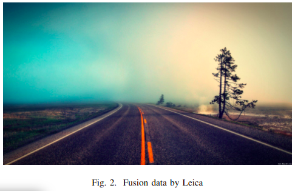
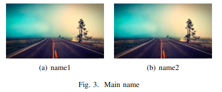

# latex写作常用

## 常用


### 图片插入

#### 单个图片
```
\usepackage{graphicx} %插入图片的宏包
\usepackage{float} %设置图片浮动位置的宏包
\usepackage{subfigure} %插入多图时用子图显示的宏包

\begin{figure}[!ht] % H为当前位置，！htb为忽略美学标准，htbp为浮动图形
    \centering %图片居中
    \includegraphics[width=8.8cm]{fusion_data.png} % []设置图片大小
    \caption{Fusion data by Leica} %标题
    \label{demo}
\end{figure}
```
- 文中引用,使用标签名:`\ref{demo}`



#### 多图横排+默认编号
```
\begin{figure}[H]
\centering  %图片全局居中
\subfigure[name1]{
\label{Fig.sub.1}
\includegraphics[width=0.45\textwidth]{DV_demand}}
\subfigure[name2]{
\label{Fig.sub.2}
\includegraphics[width=0.45\textwidth]{P+R_demand}}
\caption{Main name}
\label{Fig.main}
\end{figure}
```



### 矩阵

#### 写单个矩阵
  
$$
\begin{equation*}
\left[
\begin{array}{cccc}
 a_{11}& a_{12} &\cdots  & a_{1n}\\
 a_{21}& a_{22} &\cdots& a_{2n}\\
 \vdots  & \vdots & \ddots & \vdots \\
 a_{n1}& a_{n2} &\cdots  &a_{nn}
\end{array}
\right]
\end{equation*}
$$
- 第三行代码中的c代表矩阵的行，c的个数代表行的个数

#### 含矩阵等式

$$
\begin{equation}
    \left[
    \begin{array}{cccc}
        1& x_{0} &...  & x_{0}^{n}\\
        1& x_{1} &...  & x_{1}^{n}\\
        \vdots& \vdots & \ddots & \vdots\\
        1& x_{n} &...  &x_{n}^{n}
    \end{array}
    \right]
    \left[
    \begin{array}{cccc}
        a_{0}\\
        a_{1}\\
        \vdots \\
        a_{n}
    \end{array}
    \right]
    =
    \left[
    \begin{array}{cccc}
        y_{0}\\
        y_{1}\\
        \vdots \\
        y_{n}
    \end{array}
    \right]
\end{equation}
$$

#### 方程组

$$
\begin{equation}
\left\{
  \begin{array}{c}
  a_{0}+a_{1}x_{0}+...+a_{n}x_{0}^{n}=y_{0} \\
  a_{0}+a_{1}x_{1}+...+a_{n}x_{1}^{n}=y_{1} \\
  \cdots\\
  a_{0}+a_{1}x_{n}+...+a_{n}x_{n}^{n}=y_{n}
  \end{array}
\right.
\end{equation}
$$